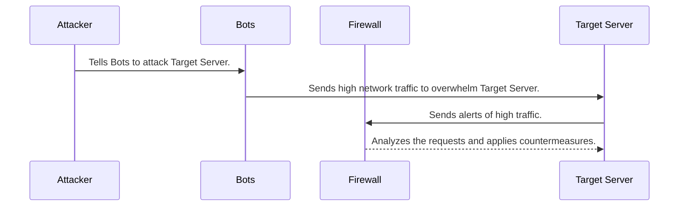

# mermaid-diagram

## Sequence Steps and Explanations:
**Attacker Initiates Attack**  
- The attacker sends a command to a pre-configured botnet, instructing it to launch a Distributed Denial of Service (DDoS) attack on the target web server.  
- The attacker remains hidden by using the botnet to carry out the actual attack.

**Botnet Launches Overwhelming Requests**  
   - The botnet consists of compromised devices that send a massive number of requests to the web server.  
   - These requests are designed to consume server resources, such as bandwidth and processing power.

**Web Server Detects Unusual Traffic Patterns**  
   - The web server begins to experience a sharp spike in traffic, causing performance degradation.  
   - Internal monitoring systems identify the abnormal traffic and alert the firewall.

**Firewall Analyzes Incoming Traffic**  
   - The firewall examines the incoming traffic to distinguish between legitimate users and malicious requests.  
   - It utilizes techniques like rate-limiting and behavior analysis to detect patterns consistent with a DDoS attack.

**Firewall Blocks Malicious IPs**  
   - Based on its analysis, the firewall blocks the IP addresses associated with the botnet.  
   - This reduces the load on the web server by preventing further malicious requests.

**Web Server Struggles to Respond**  
   - During the attack, the web server struggles to process legitimate requests as its resources are overwhelmed.  
   - This results in delays or downtime for legitimate users.

**Firewall Logs Attack Details**  
   - The firewall logs all information related to the attack, including timestamps, IP addresses, and attack patterns.  
   - These logs are essential for further analysis and improving future defensive measures.

## Contributions:
* Attacker: Initiates the attack by leveraging a botnet to disguise themselves and amplify the attack's scale. Directs the attack and determines its type and target.
* Botnet: Acts as the attacker’s distributed force, generating massive amounts of malicious traffic from compromised devices. Magnifies the scale of the attack while hiding the attacker’s identity.
* Web Server: The primary target of the attack. Its role is to handle user requests and maintain functionality during the attack. Detects abnormal traffic patterns and works with the firewall to implement mitigation strategies.
* Firewall: A key defensive system that analyzes incoming traffic, blocks malicious requests, and protects the web server. Implements traffic filtering, IP blocking, and logging for further analysis and response.

